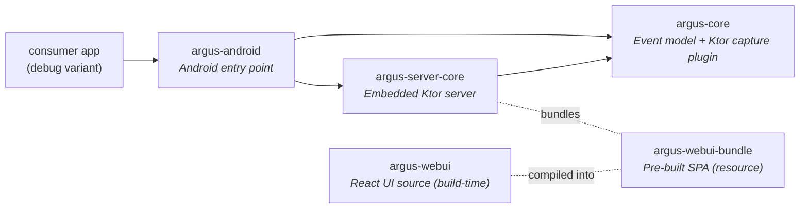

# Argus

In-app debug tooling for Kotlin Multiplatform apps. Argus runs an embedded Ktor server inside debug builds and serves a desktop-class web UI on the local network — open any browser on the same Wi-Fi and inspect HTTP traffic, application logs, and custom events on a single unified timeline. Built Ktor-first (no OkHttp shim), KMP-ready, and engineered so release builds contain zero Argus classes by construction.


- **Ktor-native HTTP capture** — first-class `HttpClient` plugin captures full request/response including bodies. No proxy, no certificate, no USB cable.
- **Unified HTTP + log timeline** — HTTP traffic and application logs (via `com.lynxal.logging`) interleave on one stream with source badges. No tab-switching.
- **Custom events** — push arbitrary structured events to the timeline from app code.
- **Real-time push** — REST + WebSocket from the embedded server; the web UI updates as events arrive.
- **Header redaction** — `Authorization`, `Cookie`, `Set-Cookie`, `Proxy-Authorization` redacted by default; configurable.
- **Debug-only by construction** — release builds contain zero Argus classes (CI gate enforces this). See [§3](#3-debug-only-distribution-model).

## 2. Status

| Attribute | Value |
|---|---|
| Version | `0.0.1` |
| Platforms | Android (KMP-ready; iOS targets compile but are not yet wired) |
| `minSdk` | 24 |
| `compileSdk` / `targetSdk` | 36 |
| Kotlin | 2.2.0 |
| Ktor | 3.2.0 |

## 3. Debug-Only Distribution Model

> [!WARNING]
> **Argus is a debug tool. It must never ship in a release build.**
>
> - Argus binds a local TCP port and serves a web UI with full request/response bodies and application logs. In a production app this is a **severe security risk**: any device on the same network can read tokens, PII, and internal traffic.
> - Argus is published with **no release-safe shim and no no-op variant** — by design. The integration pattern below makes release inclusion physically impossible when followed: a release build that imports `com.lynxal.argus.*` will not compile, and one that links it transitively will be caught by `:sample-android:verifyReleaseHasNoArgus` (CI gate).
> - **Use `debugImplementation` (and optionally `stagingImplementation`).** Never `implementation`, `releaseImplementation`, or `api` — all four leak Argus into the release APK.

The integration pattern (next section) is non-negotiable. It is what keeps the warning above true.

## 4. Installation — Android

Every code block below is copied verbatim from [`:sample-android`](./sample-android), which is gated on every PR by `:sample-android:verifyReleaseHasNoArgus`. If the sample builds, this README is correct.

### Step 1 — Add the dependency, debug only

`app/build.gradle.kts`:

```kotlin
dependencies {
    debugImplementation("com.lynxal.argus:argus-android:0.0.1")
    // stagingImplementation("com.lynxal.argus:argus-android:0.0.1") // optional, see §5
}
```

> [!IMPORTANT]
> Do **not** use `implementation`, `api`, or `releaseImplementation`. All four pull Argus into the release APK.

### Step 2 — Define the seam in `src/main/`

A plain Kotlin interface that names every capability the debug tool exposes. The interface lives in `src/main/` (or `src/androidMain/` for KMP modules) and **imports nothing from `com.lynxal.argus.*`** — that's what makes the release source set able to provide a no-op without compile errors.

`src/androidMain/kotlin/com/example/yourapp/debug/DebugTools.kt`:

```kotlin
package com.lynxal.argus.sample.debug

import io.ktor.client.HttpClient
import kotlinx.coroutines.flow.StateFlow

interface DebugTools {
    fun buildHttpClient(): HttpClient
    fun installLogging()
    fun observeArgusUrl(): StateFlow<String?>
}
```

### Step 3 — Debug implementation (`src/debug/`)

This is where Argus is started and wired into the Ktor `HttpClient` and the logger.

`src/androidDebug/kotlin/com/example/yourapp/debug/DebugToolsImpl.kt`:

```kotlin
package com.lynxal.argus.sample.debug

import android.app.Application
import com.lynxal.argus.android.Argus
import com.lynxal.argus.android.ArgusHandle
import com.lynxal.argus.logging.ArgusLoggerDelegate
import com.lynxal.logging.DebugLoggerImplementation
import com.lynxal.logging.LogLevel
import com.lynxal.logging.Logger
import io.ktor.client.HttpClient
import io.ktor.client.engine.cio.CIO
import io.ktor.client.plugins.contentnegotiation.ContentNegotiation
import io.ktor.serialization.kotlinx.json.json
import kotlinx.coroutines.flow.StateFlow
import com.lynxal.argus.ktor.Argus as ArgusPlugin

class DebugToolsImpl(private val app: Application) : DebugTools {
    private val argus: ArgusHandle = Argus.start(app) {
        port = 8787
        maxBodyBytes = 262_144L
    }

    override fun buildHttpClient(): HttpClient = HttpClient(CIO) {
        install(ArgusPlugin) {
            eventBus = argus.eventBus
            maxBodyBytes = 262_144L
        }
        install(ContentNegotiation) {
            json()
        }
    }

    override fun installLogging() {
        Logger.minLevel = LogLevel.Verbose
        Logger.add(DebugLoggerImplementation())
        Logger.add(ArgusLoggerDelegate(argus.eventBus))
    }

    override fun observeArgusUrl(): StateFlow<String?> = argus.url
}
```

### Step 4 — Release implementation (`src/release/`)

A no-op that mirrors the same shape. The leading invariant comment is **important** — keep it:

`src/androidRelease/kotlin/com/example/yourapp/debug/DebugToolsImpl.kt`:

```kotlin
// Invariant: this file must not import anything from com.lynxal.argus.*
// Enforced by :sample-android:verifyReleaseHasNoArgus (dexdump the release APK for
// com/lynxal/argus/, io/ktor/server/, com/lynxal/argus/webui/ — fail if any are present).
package com.lynxal.argus.sample.debug

import android.app.Application
import com.lynxal.logging.DebugLoggerImplementation
import com.lynxal.logging.Logger
import io.ktor.client.HttpClient
import io.ktor.client.engine.cio.CIO
import io.ktor.client.plugins.contentnegotiation.ContentNegotiation
import io.ktor.serialization.kotlinx.json.json
import kotlinx.coroutines.flow.MutableStateFlow
import kotlinx.coroutines.flow.StateFlow
import kotlinx.coroutines.flow.asStateFlow

class DebugToolsImpl(@Suppress("unused") private val app: Application) : DebugTools {
    private val empty: StateFlow<String?> = MutableStateFlow<String?>(null).asStateFlow()

    override fun buildHttpClient(): HttpClient = HttpClient(CIO) {
        install(ContentNegotiation) {
            json()
        }
    }

    override fun installLogging() {
        Logger.add(DebugLoggerImplementation())
    }

    override fun observeArgusUrl(): StateFlow<String?> = empty
}
```

### Step 5 — Wire it up

Application code calls only `DebugTools` methods. The build variant decides which `DebugToolsImpl` is on the classpath.

`src/androidMain/kotlin/com/example/yourapp/SampleApp.kt`:

```kotlin
package com.lynxal.argus.sample

import android.app.Application
import com.lynxal.argus.sample.debug.DebugTools
import com.lynxal.argus.sample.debug.DebugToolsImpl
import io.ktor.client.HttpClient

class SampleApp : Application() {
    lateinit var debugTools: DebugTools
        private set
    lateinit var httpClient: HttpClient
        private set

    override fun onCreate() {
        super.onCreate()
        debugTools = DebugToolsImpl(this)
        debugTools.installLogging()
        httpClient = debugTools.buildHttpClient()
    }
}
```

That's the full integration. Run a debug build, hit any HTTP endpoint, and Argus is capturing.

## 5. Optional: Staging Variant

Argus does not define a `staging` build type — that's a consumer concern. If your app has a staging variant and you want Argus there too:

1. Add a `staging` build type in your `app/build.gradle.kts` (typically `initWith debug`).
2. Add the dependency: `stagingImplementation("com.lynxal.argus:argus-android:0.0.1")`.
3. Create `src/staging/kotlin/.../debug/DebugToolsImpl.kt` mirroring the debug source-set impl from §4.

The same source-set seam pattern works for any number of variants. What it never does is leak Argus into `release`.

## 6. Discovering the device from your desktop

When `Argus.start()` succeeds, it logs the URL to logcat:

```
I/Argus: Argus listening on http://192.168.1.42:8787
```

Filter logcat for `Argus` and you'll see it on every debug launch. Open that URL in any browser on the same Wi-Fi and the inspector loads.

The URL is also exposed reactively:

```kotlin
debugTools.observeArgusUrl().collect { url ->
    // show in a debug-only overlay or share sheet
}
```

If logcat isn't handy (Canvas Hub firmware, headless device), enter the device's LAN IP and the configured port directly in the browser.

## 7. UI walkthrough

**Event list.** Single-column stream with source badge (HTTP/LOG/CUSTOM), method or log level, status pill, primary text (host in muted, path in primary), and meta (duration or timestamp). Compact (28 px) and comfy (32 px) row densities. Keyboard navigation moves a 2 px focus rail down the left edge.


**Detail tabs.** The right pane in split view (above) shows a tabbed detail per event. HTTP events: `Overview · Headers · Request · Response · Timing · cURL`. Log events: `Overview · Context · Stack`. Custom events: `Overview · Payload`. Bodies render as syntax-highlighted JSON, plain text, hex+ASCII, or image preview based on content type.

**Filters.** Toggle source (HTTP/LOG/CUSTOM), method (GET/POST/PUT/PATCH/DELETE/OTHER), status class (2xx/3xx/4xx/5xx/ERR), and log level (ERROR/WARN/INFO/DEBUG/VERB) as filled chips. Add text filters for host, tag, and free-text contains. Active filters are tinted in the source's color.


**Waterfall.** Time axis with per-event tracks. HTTP requests stack as Connect / Wait / Download segments, each tinted by status; errored requests render as a dashed red bar. Log and custom events show as 2 px ticks at their timestamp. Zoom in/out from the header.


**Export.** Copy any event as cURL. Headers and bodies copy individually. The whole stream exports as JSON.

**Keyboard shortcuts.** `/` focuses search. `j` / `k` navigate the event list. `1` / `2` / `3` switch List / Split / Waterfall views. `p` pauses live ingest. `?` opens the shortcut overlay.

## 8. Configuration reference

`Argus.start()` takes a builder block. All options have sensible defaults:

| Option | Default | Description |
|---|---|---|
| `port` | `0` (OS-assigned) | TCP port for the embedded server. Pin (e.g. `8787`) for a stable URL — `start()` fails if a pinned port is in use. |
| `maxEvents` | `500` | Ring-buffer size. Older events are dropped beyond this. |
| `maxBodyBytes` | `1_000_000` (1 MB) | Per-body capture cap. Bodies larger than this are truncated. |
| `redactHeaders` | `["Authorization", "Cookie", "Set-Cookie", "Proxy-Authorization"]` | HTTP header names whose values are replaced with `***redacted***` before capture. |
| `corsDevOrigins` | `["http://localhost:5173"]` | Extra CORS origins for the dev web UI. The bundled production UI is served same-origin and needs no entry here. |

Example (from `:sample-android`):

```kotlin
Argus.start(application) {
    port = 8787
    maxBodyBytes = 262_144L  // 256 KB
}
```

## 9. Sample app

[`:sample-android`](./sample-android) is the canonical, runnable reference. Every code block in §4 is copied from it.

```bash
git clone https://github.com/lynxal/argus.git
cd argus
./gradlew :sample-android:installDebug
```

Launch the sample on a device or emulator, hit a couple of buttons, and open the URL from logcat. You should see Argus working in two minutes.

The sample also defines `:sample-android:verifyReleaseHasNoArgus`, which assembles the release APK and dexdumps every class — failing if any `com/lynxal/argus/` or `io/ktor/server/` prefix appears. Run it locally any time you change variant wiring:

```bash
./gradlew :sample-android:verifyReleaseHasNoArgus
```

## 10. Architecture



| Module | Coordinates | Purpose |
|---|---|---|
| `argus-core` | `com.lynxal.argus:argus-core:0.0.1` | Shared model, `ArgusClientPlugin` (Ktor capture), event bus, redaction. |
| `argus-server-core` | `com.lynxal.argus:argus-server-core:0.0.1` | Embedded Ktor server: REST + WebSocket endpoints, event dispatcher, `ArgusConfig`. |
| `argus-webui-bundle` | `com.lynxal.argus:argus-webui-bundle:0.0.1` | Pre-built React SPA shipped as a JVM resource the server statically serves. |
| `argus-android` | `com.lynxal.argus:argus-android:0.0.1` | Android entry point: `Argus.start()`, `ArgusHandle`, `ArgusConfigBuilder`. |

**Why debug-only?** See [§3](#3-debug-only-distribution-model). The summary: the embedded server is a production-grade attack surface, and the seam-pattern source-set split (with the `verifyReleaseHasNoArgus` CI gate) is the only integration shape we support. There is no no-op artifact, by design — a missing release-side `DebugToolsImpl` is a build error, which is the desired failure mode.

## 11. Troubleshooting

**Can't connect from desktop.** Most common causes, in order:

1. **Guest Wi-Fi or AP isolation.** Many corporate / coffee-shop / hotel networks block client-to-client traffic. Use a dedicated dev network, a personal hotspot, or `adb reverse tcp:8787 tcp:8787` over USB.
2. **Firewall.** macOS / Windows firewalls can block inbound to the device-side server. Confirm the desktop can `curl http://<device-ip>:8787/api/events`.
3. **Port conflict.** If you pinned `port = 8787` and another process owns it, `Argus.start()` fails. Drop the pin (use `port = 0`) or pick a different port.
4. **IP changed.** The device's LAN IP can change between sessions. The logcat line is authoritative — read it fresh on each launch.

**Release build fails to compile / link.** Confirm `src/release/.../debug/DebugToolsImpl.kt` exists and has the same shape as `src/debug/.../debug/DebugToolsImpl.kt` but **zero `com.lynxal.argus.*` imports**. The release-source-set file is what makes the variant compile when Argus is absent.

**Release APK contains Argus classes.** Run `:sample-android:verifyReleaseHasNoArgus` (or the equivalent in your app) for the canonical diagnostic. Then:

```bash
./gradlew :app:dependencies --configuration releaseRuntimeClasspath | grep -i argus
```

If anything appears, you have an `implementation`, `api`, or `releaseImplementation` line pulling Argus in transitively (often via a shared library that itself uses `implementation` instead of `debugImplementation`). Convert it to `debugImplementation`.

**Something else.** [`:sample-android`](./sample-android) is the canonical working integration. Diff your variant wiring against it.

## 12. Contributing & License

Issues and pull requests are welcome via GitHub. There is no `CONTRIBUTING.md` yet — the short version: fork, branch, run `./gradlew check :sample-android:verifyReleaseHasNoArgus`, open a PR.

License: not yet declared. A `LICENSE` file will land before `1.0.0`.
