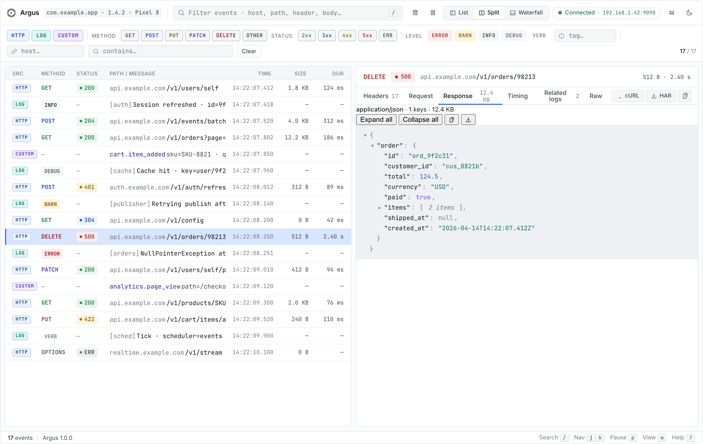
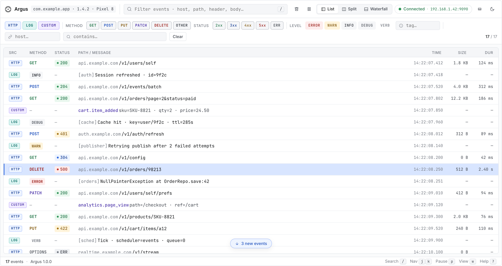
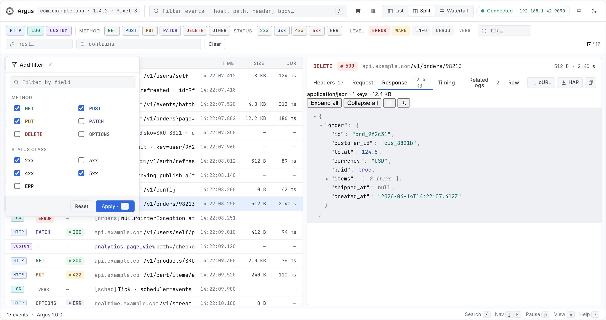
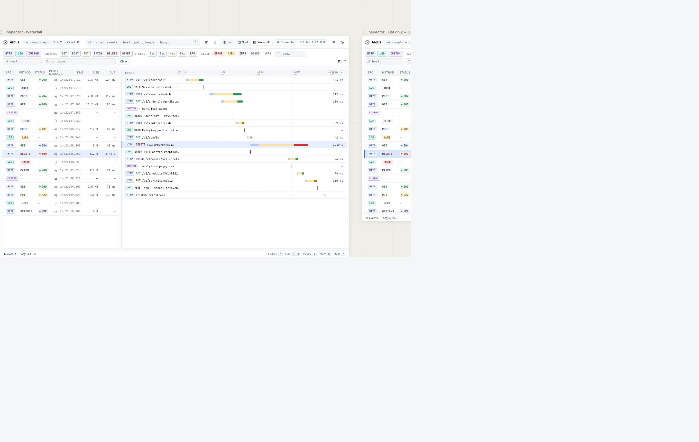
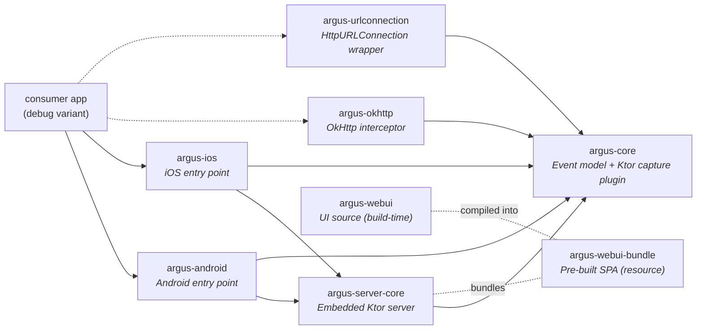

# Argus

**Argus** takes its name from Argus Panoptes — the hundred-eyed giant of Greek myth, set by Hera to watch over Io. The library shares the job description: see everything the app does, miss nothing.

In practice, that means: in-app debug tooling for Kotlin Multiplatform apps. Argus runs an embedded Ktor server inside debug builds and serves a desktop-class web UI on the local network — open any browser on the same Wi-Fi and inspect HTTP traffic, application logs, and custom events on a single unified timeline. Built Ktor-first (no OkHttp shim), KMP-ready, and engineered so release builds contain zero Argus classes by construction.



- **Ktor-native HTTP capture** — first-class `HttpClient` plugin captures full request/response including bodies. No proxy, no certificate, no USB cable.
- **Unified HTTP + log timeline** — HTTP traffic and application logs (via `com.lynxal.logging`) interleave on one stream with source badges. No tab-switching.
- **Custom events** — push arbitrary structured events to the timeline from app code.
- **Real-time push** — REST + WebSocket from the embedded server; the web UI updates as events arrive.
- **Header redaction** — `Authorization`, `Cookie`, `Set-Cookie`, `Proxy-Authorization` redacted by default; configurable.
- **Debug-only by construction** — release builds contain zero Argus classes (CI gate enforces this). See [§3](#3-debug-only-distribution-model).

## 2. Status

| Attribute | Value |
|---|---|
| Version | `0.0.2` |
| Platforms | Android, iOS (Ktor-host apps) |
| `minSdk` | 24 |
| `compileSdk` / `targetSdk` | 36 |
| Kotlin | 2.2.0 |
| Ktor | 3.2.0 |

## 3. Debug-Only Distribution Model

> [!WARNING]
> **Argus is a debug tool. It must never ship in a release build.**
>
> - Argus binds a local TCP port and serves a web UI with full request/response bodies and application logs. In a production app this is a **severe security risk**: any device on the same network can read tokens, PII, and internal traffic.
> - Argus is published with **no release-safe shim and no no-op variant** — by design. The integration pattern below makes release inclusion physically impossible when followed: a release build that imports `com.lynxal.argus.*` will not compile, and one that links it transitively will be caught by `:sample:verifyReleaseHasNoArgus` (CI gate).
> - **Use `debugImplementation` (and optionally `stagingImplementation`).** Never `implementation`, `releaseImplementation`, or `api` — all four leak Argus into the release APK.

The integration pattern (next section) is non-negotiable. It is what keeps the warning above true.

## 4. Installation — Android

Every code block below is copied verbatim from [`:sample`](./sample), which is gated on every PR by `:sample:verifyReleaseHasNoArgus`. If the sample builds, this README is correct.

### Step 1 — Add the dependency, debug only

`app/build.gradle.kts`:

```kotlin
dependencies {
    debugImplementation("com.lynxal.argus:argus-android:0.0.2")
    // stagingImplementation("com.lynxal.argus:argus-android:0.0.2") // optional, see §5
}
```

> [!IMPORTANT]
> Do **not** use `implementation`, `api`, or `releaseImplementation`. All four pull Argus into the release APK.

### Step 2 — Define the seam in `src/main/`

A plain Kotlin interface that names every capability the debug tool exposes. The interface lives in `src/main/` (or `src/androidMain/` for KMP modules) and **imports nothing from `com.lynxal.argus.*`** — that's what makes the release source set able to provide a no-op without compile errors.

`src/androidMain/kotlin/com/example/yourapp/debug/DebugTools.kt`:

```kotlin
package com.lynxal.argus.sample.debug

import io.ktor.client.HttpClient
import kotlinx.coroutines.flow.StateFlow

interface DebugTools {
    fun buildHttpClient(): HttpClient
    fun installLogging()
    fun observeArgusUrl(): StateFlow<String?>

    /** Emit a CustomEvent through the sample's bus. No-op in release. */
    fun publishCustom(source: String, label: String, payload: String)

    /** Fire an OkHttp request through Argus's interceptor. No-op in release. */
    fun fireOkHttpCall(url: String)

    /** Fire an HttpURLConnection request wrapped by Argus. No-op in release. */
    fun fireUrlConnectionCall(url: String)

    /**
     * Fire two HTTP calls back-to-back inside one ArgusCorrelationId scope so the
     * resulting events share a correlation id. Lives behind the debug seam because
     * ArgusCorrelationId is in `:argus-core`, which release variants must not link.
     * No-op in release.
     */
    fun fireCorrelatedPair(first: String, second: String)
}
```

### Step 3 — Debug implementation (`src/debug/`)

This is where Argus is started and wired into the Ktor `HttpClient` and the logger.

`src/androidDebug/kotlin/com/example/yourapp/debug/DebugToolsImpl.kt`:

```kotlin
package com.lynxal.argus.sample.debug

import android.app.Application
import com.lynxal.argus.android.Argus
import com.lynxal.argus.android.ArgusHandle
import com.lynxal.argus.correlation.withCorrelation
import com.lynxal.argus.logging.ArgusLoggerDelegate
import com.lynxal.argus.model.Direction
import com.lynxal.argus.model.publishCustom
import com.lynxal.argus.okhttp.ArgusOkHttpConfig
import com.lynxal.argus.okhttp.ArgusOkHttpInterceptor
import com.lynxal.argus.urlconnection.ArgusUrlConnection
import com.lynxal.argus.urlconnection.ArgusUrlConnectionConfig
import com.lynxal.logging.DebugLoggerImplementation
import com.lynxal.logging.LogLevel
import com.lynxal.logging.Logger
import io.ktor.client.HttpClient
import io.ktor.client.engine.cio.CIO
import io.ktor.client.plugins.contentnegotiation.ContentNegotiation
import io.ktor.client.request.get
import io.ktor.serialization.kotlinx.json.json
import java.net.HttpURLConnection
import java.net.URL
import kotlinx.coroutines.CoroutineScope
import kotlinx.coroutines.Dispatchers
import kotlinx.coroutines.SupervisorJob
import kotlinx.coroutines.flow.StateFlow
import kotlinx.coroutines.launch
import okhttp3.OkHttpClient
import okhttp3.Request
import com.lynxal.argus.ktor.Argus as ArgusPlugin

class DebugToolsImpl(private val app: Application) : DebugTools {
    private val argus: ArgusHandle = Argus.start(app) {
        port = 8787
        maxBodyBytes = 262_144L
    }

    private val ioScope = CoroutineScope(SupervisorJob() + Dispatchers.IO)

    private val okHttpClient: OkHttpClient by lazy {
        OkHttpClient.Builder()
            .addInterceptor(
                ArgusOkHttpInterceptor(
                    argus.eventBus,
                    ArgusOkHttpConfig().apply { maxBodyBytes = 262_144L },
                ),
            )
            .build()
    }

    private val ktorClient: HttpClient by lazy {
        HttpClient(CIO) {
            install(ArgusPlugin) {
                eventBus = argus.eventBus
                maxBodyBytes = 262_144L
            }
            install(ContentNegotiation) {
                json()
            }
        }
    }

    override fun buildHttpClient(): HttpClient = ktorClient

    override fun installLogging() {
        Logger.minLevel = LogLevel.Verbose
        Logger.add(DebugLoggerImplementation())
        Logger.add(ArgusLoggerDelegate(argus.eventBus))
    }

    override fun observeArgusUrl(): StateFlow<String?> = argus.url

    override fun publishCustom(source: String, label: String, payload: String) {
        argus.eventBus.publishCustom(
            source = source,
            label = label,
            direction = Direction.NONE,
            payload = payload,
        )
    }

    override fun fireOkHttpCall(url: String) {
        ioScope.launch {
            runCatching {
                okHttpClient.newCall(Request.Builder().url(url).build()).execute().use {
                    it.body?.string()
                }
            }
        }
    }

    override fun fireUrlConnectionCall(url: String) {
        ioScope.launch {
            runCatching {
                val raw = URL(url).openConnection() as HttpURLConnection
                val cfg = ArgusUrlConnectionConfig().apply { maxBodyBytes = 262_144L }
                val conn = ArgusUrlConnection.wrap(raw, argus.eventBus, cfg)
                try {
                    conn.connect()
                    conn.inputStream.use { it.readBytes() }
                } finally {
                    conn.disconnect()
                }
            }
        }
    }

    override fun fireCorrelatedPair(first: String, second: String) {
        ioScope.launch {
            withCorrelation {
                val logger = Logger.tag("Argus sample")
                logger.info { message = "correlated-pair: starting" }
                runCatching { ktorClient.get(first) }
                logger.info { message = "correlated-pair: first done, firing second" }
                runCatching { ktorClient.get(second) }
                logger.info { message = "correlated-pair: done" }
            }
        }
    }
}
```

### Step 4 — Release implementation (`src/release/`)

A no-op that mirrors the same shape. The leading invariant comment is **important** — keep it:

`src/androidRelease/kotlin/com/example/yourapp/debug/DebugToolsImpl.kt`:

```kotlin
// Invariant: this file must not import anything from com.lynxal.argus.*
// Enforced by :sample:verifyReleaseHasNoArgus (dexdump the release APK for
// com/lynxal/argus/, io/ktor/server/, com/lynxal/argus/webui/ — fail if any are present).
package com.lynxal.argus.sample.debug

import android.app.Application
import com.lynxal.logging.DebugLoggerImplementation
import com.lynxal.logging.Logger
import io.ktor.client.HttpClient
import io.ktor.client.engine.cio.CIO
import io.ktor.client.plugins.contentnegotiation.ContentNegotiation
import io.ktor.serialization.kotlinx.json.json
import kotlinx.coroutines.flow.MutableStateFlow
import kotlinx.coroutines.flow.StateFlow
import kotlinx.coroutines.flow.asStateFlow

class DebugToolsImpl(@Suppress("unused") private val app: Application) : DebugTools {
    private val empty: StateFlow<String?> = MutableStateFlow<String?>(null).asStateFlow()

    override fun buildHttpClient(): HttpClient = HttpClient(CIO) {
        install(ContentNegotiation) {
            json()
        }
    }

    override fun installLogging() {
        Logger.add(DebugLoggerImplementation())
    }

    override fun observeArgusUrl(): StateFlow<String?> = empty

    override fun publishCustom(source: String, label: String, payload: String) {
        // no-op in release
    }

    override fun fireOkHttpCall(url: String) {
        // no-op in release
    }

    override fun fireUrlConnectionCall(url: String) {
        // no-op in release
    }

    override fun fireCorrelatedPair(first: String, second: String) {
        // no-op in release
    }
}
```

### Step 5 — Wire it up

Application code calls only `DebugTools` methods. The build variant decides which `DebugToolsImpl` is on the classpath.

`src/androidMain/kotlin/com/example/yourapp/SampleApp.kt`:

```kotlin
package com.lynxal.argus.sample

import android.app.Application
import com.lynxal.argus.sample.debug.DebugTools
import com.lynxal.argus.sample.debug.DebugToolsImpl
import io.ktor.client.HttpClient

class SampleApp : Application() {
    lateinit var debugTools: DebugTools
        private set
    lateinit var httpClient: HttpClient
        private set

    override fun onCreate() {
        super.onCreate()
        debugTools = DebugToolsImpl(this)
        debugTools.installLogging()
        httpClient = debugTools.buildHttpClient()
    }
}
```

That's the full integration. Run a debug build, hit any HTTP endpoint, and Argus is capturing.

## 5. Installation — iOS

Every code block below is copied verbatim from [`:sample`](./sample), which is gated by `:sample:verifyIosReleaseHasNoArgus` — an `xcodebuild -configuration Release` followed by a symbol scan of the produced framework. If the sample builds, this README is correct.

The iOS seam works the same way as Android (interface in shared code, real impl in a debug-only source dir, no-op impl in a release source dir) but the variant selection is driven by a Gradle property (`-PargusEnabled`) that the Xcode build phase script flips based on `$CONFIGURATION` instead of by the Android build type.

> [!IMPORTANT]
> Argus iOS captures Ktor `HttpClient` traffic only. URLSession / Alamofire / native networking interception is **not** supported — your iOS app must use Ktor for HTTP if you want it on the timeline.

### Alternative — pure Swift / Xcode-only apps via Swift Package Manager

If your iOS app does **not** use Kotlin Multiplatform, consume Argus as an XCFramework via SPM:

1. In Xcode: **File → Add Packages…** and enter `https://github.com/lynxal/argus`.
2. Select **Up to next major version** and add the `ArgusIOS` library to your debug app target.
3. SPM has no native build-config gating, so the binary is the same in debug and release. Wrap your usage in `#if DEBUG` (or split debug/release schemes) so the released app does not link Argus:

```swift
#if DEBUG
import ArgusIOS

let handle = Argus.shared.start { config in
    config.port = 8787
}
#endif
```

The XCFramework is built by Gradle (`./gradlew :argus-ios:assembleArgus-iosReleaseXCFramework`) and published as a release asset on each Argus release. KMP-based apps should keep using `implementation("com.lynxal.argus:argus-ios:0.0.2")` from Maven Central — the steps below describe that path.

### Step 1 — Add iOS targets to your KMP module + Xcode build-phase script

In your sample's `build.gradle.kts`, add iOS targets and a shared framework. Read the `argusEnabled` property at config time, conditionally add `:argus-ios` to `iosMain` deps, and swap the source dir between an enabled and disabled impl:

```kotlin
val argusEnabled: Boolean =
    (findProperty("argusEnabled") as? String)?.toBoolean() ?: false

kotlin {
    androidTarget { /* … */ }
    listOf(iosX64(), iosArm64(), iosSimulatorArm64()).forEach {
        it.binaries.framework {
            baseName = "Sample"
            isStatic = true
        }
    }
    applyDefaultHierarchyTemplate()
    sourceSets {
        val iosMain by getting {
            kotlin.srcDir(
                if (argusEnabled) "src/iosArgusEnabledMain/kotlin"
                else "src/iosArgusDisabledMain/kotlin"
            )
            dependencies {
                implementation(libs.ktor.client.darwin)
                if (argusEnabled) implementation(projects.argusIos)
            }
        }
    }
}
```

In your `iosApp.xcodeproj`, the **Compile Kotlin Framework** build phase passes `-PargusEnabled` based on `$CONFIGURATION`:

```sh
cd "$SRCROOT/../.."
if [ "$CONFIGURATION" = "Debug" ]; then
  ARGUS_ENABLED=true
else
  ARGUS_ENABLED=false
fi
./gradlew :sample:embedAndSignAppleFrameworkForXcode "-PargusEnabled=$ARGUS_ENABLED"
```

The Xcode app target also needs `OTHER_LDFLAGS = -lsqlite3` (Argus uses SqlDelight's `NativeSqliteDriver` for optional event persistence; the host app supplies the system sqlite link).

### Step 2 — Reuse the same `DebugTools` interface

The interface defined in §4 Step 2 lives in `commonMain/` and works for both Android and iOS — the Android impls under `src/androidDebug/` + `src/androidRelease/` and the iOS impls under `src/iosArgusEnabledMain/` + `src/iosArgusDisabledMain/` all satisfy the same shape. No duplication.

### Step 3 — Debug implementation (`src/iosArgusEnabledMain/`)

```kotlin
package com.lynxal.argus.sample.debug

import com.lynxal.argus.correlation.withCorrelation
import com.lynxal.argus.ios.Argus
import com.lynxal.argus.ios.ArgusHandle
import com.lynxal.argus.logging.ArgusLoggerDelegate
import com.lynxal.argus.model.Direction
import com.lynxal.argus.model.publishCustom
import com.lynxal.logging.DebugLoggerImplementation
import com.lynxal.logging.LogLevel
import com.lynxal.logging.Logger
import io.ktor.client.HttpClient
import io.ktor.client.engine.darwin.Darwin
import io.ktor.client.plugins.contentnegotiation.ContentNegotiation
import io.ktor.client.request.get
import io.ktor.serialization.kotlinx.json.json
import kotlinx.coroutines.CoroutineScope
import kotlinx.coroutines.Dispatchers
import kotlinx.coroutines.IO
import kotlinx.coroutines.SupervisorJob
import kotlinx.coroutines.flow.StateFlow
import kotlinx.coroutines.launch
import com.lynxal.argus.ktor.Argus as ArgusPlugin

class DebugToolsImpl : DebugTools {
    private val argus: ArgusHandle = Argus.start {
        port = 8787
        maxBodyBytes = 262_144L
    }
    private val ioScope = CoroutineScope(SupervisorJob() + Dispatchers.IO)

    private val ktorClient: HttpClient by lazy {
        HttpClient(Darwin) {
            install(ArgusPlugin) {
                eventBus = argus.eventBus
                maxBodyBytes = 262_144L
            }
            install(ContentNegotiation) {
                json()
            }
        }
    }

    override fun buildHttpClient(): HttpClient = ktorClient

    override fun installLogging() {
        Logger.minLevel = LogLevel.Verbose
        Logger.add(DebugLoggerImplementation())
        Logger.add(ArgusLoggerDelegate(argus.eventBus))
    }

    override fun observeArgusUrl(): StateFlow<String?> = argus.url

    override fun publishCustom(source: String, label: String, payload: String) {
        argus.eventBus.publishCustom(
            source = source,
            label = label,
            direction = Direction.NONE,
            payload = payload,
        )
    }

    override fun fireOkHttpCall(url: String) {
        // OkHttp engine is JVM-only; no iOS counterpart.
    }

    override fun fireUrlConnectionCall(url: String) {
        // HttpURLConnection is JVM-only; no iOS counterpart.
    }

    override fun fireCorrelatedPair(first: String, second: String) {
        ioScope.launch {
            withCorrelation {
                val logger = Logger.tag("Argus sample")
                logger.info { message = "correlated-pair: starting" }
                runCatching { ktorClient.get(first) }
                logger.info { message = "correlated-pair: first done, firing second" }
                runCatching { ktorClient.get(second) }
                logger.info { message = "correlated-pair: done" }
            }
        }
    }
}
```

### Step 4 — Release implementation (`src/iosArgusDisabledMain/`)

The leading invariant comment is **important** — keep it.

```kotlin
// Invariant: this file must not import anything from com.lynxal.argus.*
// Enforced by :sample:verifyIosReleaseHasNoArgus (xcodebuild Release then nm/strings
// on the produced framework binary — fails if any com.lynxal.argus., kfun:com.lynxal.argus.,
// io.ktor.server., ArgusServer, or ArgusEventBus symbol is present).
package com.lynxal.argus.sample.debug

import com.lynxal.logging.DebugLoggerImplementation
import com.lynxal.logging.LogLevel
import com.lynxal.logging.Logger
import io.ktor.client.HttpClient
import io.ktor.client.engine.darwin.Darwin
import kotlinx.coroutines.flow.MutableStateFlow
import kotlinx.coroutines.flow.StateFlow
import kotlinx.coroutines.flow.asStateFlow

class DebugToolsImpl : DebugTools {
    private val empty: StateFlow<String?> = MutableStateFlow<String?>(null).asStateFlow()
    override fun buildHttpClient(): HttpClient = HttpClient(Darwin)
    override fun installLogging() { Logger.add(DebugLoggerImplementation()) }
    override fun observeArgusUrl(): StateFlow<String?> = empty
    override fun publishCustom(source: String, label: String, payload: String) {}
    override fun fireOkHttpCall(url: String) {}
    override fun fireUrlConnectionCall(url: String) {}
    override fun fireCorrelatedPair(first: String, second: String) {}
}
```

### Step 5 — Wire it up via ComposeUIViewController + Swift

In `iosMain/`, expose a single `MainViewController()` that constructs the right `DebugToolsImpl` (selected by source-dir swap) and wraps the Compose UI in a UIKit view controller:

```kotlin
package com.lynxal.argus.sample

import androidx.compose.ui.window.ComposeUIViewController
import com.lynxal.argus.sample.debug.DebugToolsImpl
import com.lynxal.argus.sample.ui.App
import platform.UIKit.UIViewController

fun MainViewController(): UIViewController {
    val tools = DebugToolsImpl()
    tools.installLogging()
    return ComposeUIViewController {
        App(
            httpClient = tools.buildHttpClient(),
            argusUrl = tools.observeArgusUrl(),
            // …callbacks delegate to tools
        )
    }
}
```

Swift entry-point (`iosApp/iOSApp.swift`):

```swift
import SwiftUI
import Sample

@main
struct ArgusSampleApp: App {
    var body: some Scene {
        WindowGroup { ContentView().ignoresSafeArea() }
    }
}

struct ContentView: UIViewControllerRepresentable {
    func makeUIViewController(context: Context) -> UIViewController {
        MainViewControllerKt.MainViewController()
    }
    func updateUIViewController(_ uiViewController: UIViewController, context: Context) {}
}
```

The Swift app calls only `MainViewControllerKt.MainViewController()` — it never imports `com.lynxal.argus.*`. Both Swift and Kotlin uphold the seam.

### Optional — CI gate

Run the iOS gate locally any time you change the build-phase script or seam wiring:

```bash
./gradlew :sample:verifyIosReleaseHasNoArgus
```

It runs `xcodebuild -configuration Release -destination 'generic/platform=iOS Simulator'` (no signing identity required), then scans the produced `Sample.framework` binary with `strings` for forbidden symbol fragments (`kfun:com.lynxal.argus.`, `io.ktor.server.`, `ArgusServer`, `ArgusEventBus`). The sample's own `com.lynxal.argus.sample.*` symbols are whitelisted.

> [!NOTE]
> The iOS framework size grows considerably when Argus is linked (Debug ≈ 65 MB with debug symbols, ≈ 17 MB stripped Release). This is fine for a debug-only artifact — the Release framework, which is what ships, contains none of it.

## 6. Optional: Staging Variant

Argus does not define a `staging` build type — that's a consumer concern. If your app has a staging variant and you want Argus there too:

1. Add a `staging` build type in your `app/build.gradle.kts` (typically `initWith debug`).
2. Add the dependency: `stagingImplementation("com.lynxal.argus:argus-android:0.0.2")`.
3. Create `src/staging/kotlin/.../debug/DebugToolsImpl.kt` mirroring the debug source-set impl from §4.

The same source-set seam pattern works for any number of variants. What it never does is leak Argus into `release`.

## 7. Discovering the device from your desktop

When `Argus.start()` succeeds, it logs the URL to logcat:

```
I/Argus: Argus listening on http://192.168.1.42:8787
```

Filter logcat for `Argus` and you'll see it on every debug launch. Open that URL in any browser on the same Wi-Fi and the inspector loads.

The URL is also exposed reactively:

```kotlin
debugTools.observeArgusUrl().collect { url ->
    // show in a debug-only overlay or share sheet
}
```

If logcat isn't handy (Canvas Hub firmware, headless device), enter the device's LAN IP and the configured port directly in the browser.

## 8. UI walkthrough

**Event list.** Single-column stream with source badge (HTTP/LOG/CUSTOM), method or log level, status pill, primary text (host in muted, path in primary), and meta (duration or timestamp). Compact (28 px) and comfy (32 px) row densities. Keyboard navigation moves a 2 px focus rail down the left edge.



**Detail tabs.** The right pane in split view (above) shows a tabbed detail per event. HTTP events: `Overview · Headers · Request · Response · Timing · cURL`. Log events: `Overview · Context · Stack`. Custom events: `Overview · Payload`. Bodies render as syntax-highlighted JSON, plain text, hex+ASCII, or image preview based on content type.

**Filters.** Toggle source (HTTP/LOG/CUSTOM), method (GET/POST/PUT/PATCH/DELETE/OTHER), status class (2xx/3xx/4xx/5xx/ERR), and log level (ERROR/WARN/INFO/DEBUG/VERB) as filled chips. Add text filters for host, tag, and free-text contains. Active filters are tinted in the source's color.



**Waterfall.** Time axis with per-event tracks. HTTP requests stack as Connect / Wait / Download segments, each tinted by status; errored requests render as a dashed red bar. Log and custom events show as 2 px ticks at their timestamp. Zoom in/out from the header.



**Export.** Copy any event as cURL. Headers and bodies copy individually. The whole stream exports as JSON.

**Keyboard shortcuts.** `/` focuses search. `j` / `k` navigate the event list. `1` / `2` / `3` switch List / Split / Waterfall views. `p` pauses live ingest. `?` opens the shortcut overlay.

## 9. Configuration reference

Argus has two config surfaces: **server-side** (`Argus.start { ... }`) for the inspector server, and **client-side** (per-engine capture plugins) for what gets recorded.

### 9.1 Server-side — `Argus.start()`

| Option | Default | Description |
|---|---|---|
| `port` | `0` (OS-assigned) | TCP port for the embedded server. Pin (e.g. `8787`) for a stable URL — `start()` fails if a pinned port is in use. |
| `maxEvents` | `500` | Ring-buffer size. Older events are dropped beyond this. |
| `maxBodyBytes` | `1_000_000` (1 MB) | Per-body capture cap. Bodies larger than this are truncated. |
| `redactHeaders` | `["Authorization", "Cookie", "Set-Cookie", "Proxy-Authorization"]` | HTTP header names whose values are replaced with `***redacted***` before capture. |
| `corsDevOrigins` | `["http://localhost:5173"]` | Extra CORS origins for the dev web UI. The bundled production UI is served same-origin and needs no entry here. Set to `emptyList()` in any non-debug context to skip the CORS plugin install. |
| `persist` | `false` | Persist events to disk so they survive process restarts. On next `Argus.start()`, the previous session's events are restored into the in-memory ring (capped at `maxEvents`). The UI does not surface older sessions — `persist` keeps the timeline alive across restarts, not a full archive. |
| `persistMaxSizeMb` | `100` | Soft cap on on-disk payload size (MB). Whichever fires first with `persistMaxAgeDays` prunes the oldest persisted events. |
| `persistMaxAgeDays` | `7` | Soft cap on persisted-event age (days). Whichever fires first with `persistMaxSizeMb`. |

Example (from `:sample`):

```kotlin
Argus.start(application) {
    port = 8787
    maxBodyBytes = 262_144L  // 256 KB
}
```

### 9.2 Client-side — capture plugins

These options live on each engine's plugin/interceptor config: Ktor `install(ArgusPlugin) { ... }`, OkHttp `ArgusInterceptor`'s `ArgusOkHttpConfig`, and HttpURLConnection's `ArgusUrlConnectionConfig`. The Ktor shape is shown; the others mirror it field-for-field.

| Option | Default | Description |
|---|---|---|
| `eventBus` | `NoopEventBus` | Sink for captured events. Set to `argusHandle.eventBus` so captures land in the inspector. |
| `maxBodyBytes` | `1_000_000` (1 MB) | Per-body capture cap. Bodies larger than this are truncated. |
| `redactHeaders` | (same default set as server) | Headers whose values are replaced with `***redacted***` before capture. |
| `captureRequestBody` | `true` | Capture request bodies. Set to `false` to record only metadata. |
| `captureResponseBody` | `true` | Capture response bodies. Set to `false` to record only metadata. |
| `fullBodyHosts` | `emptySet()` | Hosts whose bodies bypass `maxBodyBytes` and are captured in full. Case-insensitive on URL host (no port, no scheme). Practical ceiling per body is ~2 GB (`Int.MAX_VALUE`) because captures are held in a single `ByteArray`; larger payloads are truncated and the event reports `truncatedTotalBytes`. Use sparingly. |

## 10. Sample apps

[`:sample`](./sample) is the canonical reference for both platforms. The same KMP module produces the Android APK and the iOS framework; Compose Multiplatform renders the shared UI on both.

**Android:**

```bash
git clone https://github.com/lynxal/argus.git
cd argus
./gradlew :sample:installDebug
```

Launch on a device or emulator, hit a couple of buttons, and open the URL from logcat. You should see Argus working in two minutes.

**iOS:** open `sample/iosApp/iosApp.xcodeproj` in Xcode and run on a simulator or device with the Debug scheme. The buttons are the same as Android; OkHttp and HttpURLConnection demos are no-ops on iOS (the engines are JVM-only).

Both gates run as part of `:sample:check`. Run them locally any time you change variant wiring:

```bash
./gradlew :sample:verifyReleaseHasNoArgus     # Android: dexdumps the release APK
./gradlew :sample:verifyIosReleaseHasNoArgus  # iOS: scans the Release framework binary
```

## 11. Architecture



| Module | Coordinates | Purpose |
|---|---|---|
| `argus-core` | `com.lynxal.argus:argus-core:0.0.2` | Shared model, `ArgusClientPlugin` (Ktor capture), event bus, redaction. |
| `argus-server-core` | `com.lynxal.argus:argus-server-core:0.0.2` | Embedded Ktor server: REST + WebSocket endpoints, event dispatcher, `ArgusConfig`. |
| `argus-webui-bundle` | `com.lynxal.argus:argus-webui-bundle:0.0.2` | Pre-built SPA shipped as a JVM resource the server statically serves. |
| `argus-android` | `com.lynxal.argus:argus-android:0.0.2` | Android entry point: `Argus.start()`, `ArgusHandle`, `ArgusConfigBuilder`. |
| `argus-ios` | `com.lynxal.argus:argus-ios:0.0.2` | iOS entry point for Apple targets: `Argus.start()`, `ArgusHandle`, `ArgusConfigBuilder`. Also published as an XCFramework via Swift Package Manager (see §5). |
| `argus-okhttp` | `com.lynxal.argus:argus-okhttp:0.0.2` | OkHttp `Interceptor` capture for non-Ktor JVM HTTP. |
| `argus-urlconnection` | `com.lynxal.argus:argus-urlconnection:0.0.2` | `HttpURLConnection` capture wrapper for legacy JVM HTTP. |

**Why debug-only?** See [§3](#3-debug-only-distribution-model). The summary: the embedded server is a production-grade attack surface, and the seam-pattern source-set split (with the `verifyReleaseHasNoArgus` CI gate) is the only integration shape we support. There is no no-op artifact, by design — a missing release-side `DebugToolsImpl` is a build error, which is the desired failure mode.

## 12. Troubleshooting

**Can't connect from desktop.** Most common causes, in order:

1. **Guest Wi-Fi or AP isolation.** Many corporate / coffee-shop / hotel networks block client-to-client traffic. Use a dedicated dev network, a personal hotspot, or `adb reverse tcp:8787 tcp:8787` over USB.
2. **Firewall.** macOS / Windows firewalls can block inbound to the device-side server. Confirm the desktop can `curl http://<device-ip>:8787/api/events`.
3. **Port conflict.** If you pinned `port = 8787` and another process owns it, `Argus.start()` fails. Drop the pin (use `port = 0`) or pick a different port.
4. **IP changed.** The device's LAN IP can change between sessions. The logcat line is authoritative — read it fresh on each launch.

**Release build fails to compile / link.** Confirm `src/release/.../debug/DebugToolsImpl.kt` exists and has the same shape as `src/debug/.../debug/DebugToolsImpl.kt` but **zero `com.lynxal.argus.*` imports**. The release-source-set file is what makes the variant compile when Argus is absent.

**Release APK contains Argus classes.** Run `:sample:verifyReleaseHasNoArgus` (or the equivalent in your app) for the canonical diagnostic. Then:

```bash
./gradlew :app:dependencies --configuration releaseRuntimeClasspath | grep -i argus
```

If anything appears, you have an `implementation`, `api`, or `releaseImplementation` line pulling Argus in transitively (often via a shared library that itself uses `implementation` instead of `debugImplementation`). Convert it to `debugImplementation`.

**Something else.** [`:sample`](./sample) is the canonical working integration. Diff your variant wiring against it.

## 13. Contributing & License

Issues and pull requests are welcome via GitHub. There is no `CONTRIBUTING.md` yet — the short version: fork, branch, run `./gradlew check :sample:verifyReleaseHasNoArgus`, open a PR.

License: not yet declared. A `LICENSE` file will land before `1.0.0`.
